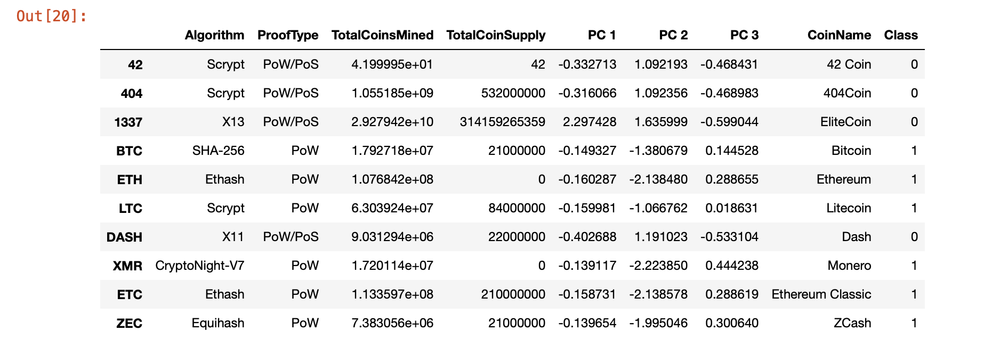
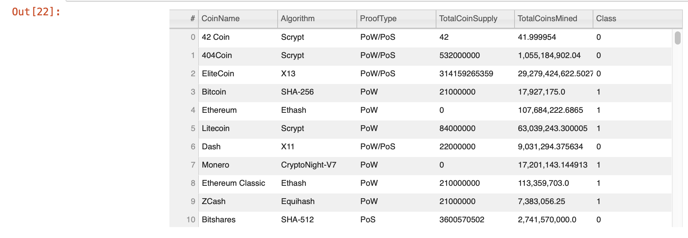
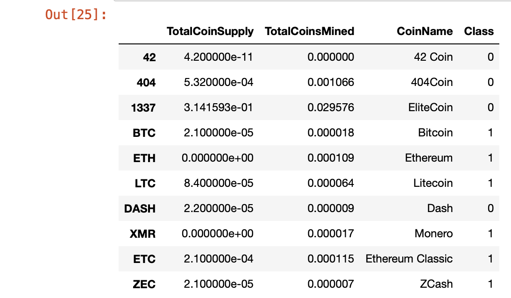
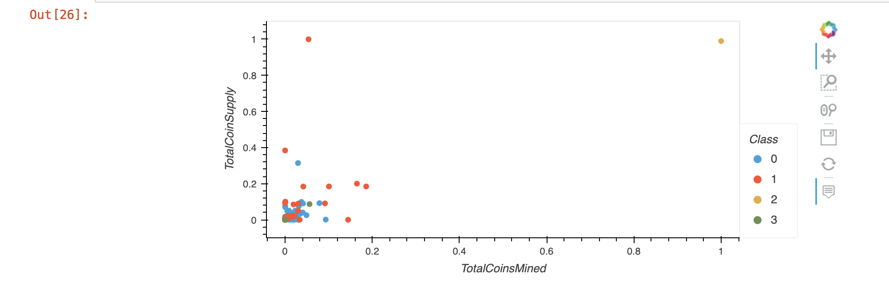

# Cryptocurrencies

## Overview

This exercise was designed to help create an analysis for a bank that is getting ready to enter the bitcoin industry. The bank is interested in providing its clients with a new portfolio of bitcoin investments. The business is dispersed over the huge world of cryptocurrencies, though. To build a classification system for this new investment, My duty is to compile a report on the cryptocurrencies that are being traded on the market.

## Resources
jupyter Notebook, Pandas, 

## Analysis

  - All cryptocurrencies that aren't exchanged have been eliminated.
  - The rows with at least one null value were all eliminated.
  - IsTrading column was dropped.
  - CoinName column was dropped.
  - The rows with no coins being mined were all deleted.
  
 

Reduced data dimensions using PCA down to three principal components.

 
 
 ### hvplot.table() 
 
  
 ### clustered_df
 
 
### 2D-Scatter plot with clusters 
 
  
## Conclusion
In general, ensemble models outperform logistic regression, with boosting outperforming bagging in terms of performance. Multiple iterations beat single iteration modeling in this situation, which is probably related to the underlying data distribution and variance.

Using the three major components, I was able to successfully create four clusters of cryptocurrencies (as determined by K-means analysis). To understand the distinctions between the clusters, further research is necessary because they are not all the same size.
