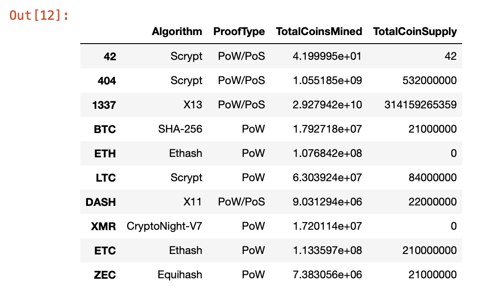

# Cryptocurrencies

## Purpose

This exercise was designed to help create an analysis for a bank that is getting ready to enter the bitcoin industry. The bank is interested in providing its clients with a new portfolio of bitcoin investments. The business is dispersed over the huge world of cryptocurrencies, though. To build a classification system for this new investment, My duty is to compile a report on the cryptocurrencies that are being traded on the market.

## Resources
jupyter Notebook, Pandas, 

## Analysis

  - All cryptocurrencies that aren't exchanged have been eliminated.
  - The rows with at least one null value were all eliminated.
  - IsTrading column was dropped.
  - CoinName column was dropped.
  - The rows with no coins being mined were all deleted.
  
 
